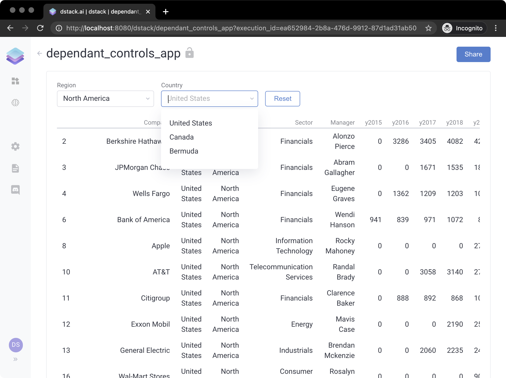
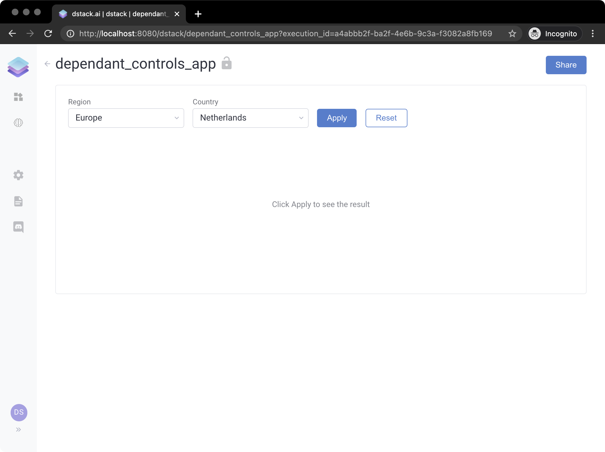

# Controls

A `dstack` application consists of controls. These controls, for example, may allow the user to change the input parameters of the application and see the corresponding outputs. The supported controls include text inputs, single and multiple selection controls, sliders, check-boxes, file uploaders, markdown outputs, table outputs, chart output, and markdown outputs.  A `dstack` application may have any number of controls arranged visually using the Grid layout. Any control \(be it input or output control\) may depend on other controls. 

Here's a simple example:

```python
import dstack as ds
import plotly.express as px

app = ds.app()  # create an instance of the application


# an utility function that loads the data
def get_data():
    return px.data.stocks()


# a drop-down control that shows stock symbols
stock = app.select(items=get_data().columns[1:].tolist())


# a handler that updates the plot based on the selected stock
def output_handler(self, stock):
    # a plotly line chart where the X axis is date and Y is the stock's price
    self.data = px.line(get_data(), x='date', y=stock.value())


# a plotly chart output
app.output(handler=output_handler, depends=[stock])

# deploy the application with the name "stocks" and print its URL
url = app.deploy("stocks")
print(url)
```

If we run the code above and open the link, we'll see the following application:


In the example above we have a drop-down control, where we pass the list of items, and we have a chart output that is dependant on the drop-down control. To define a control that depends on other controls, you have to pass a handler, and the list of controls it's supposed to depend on:

```python
# a handler that updates the plot based on the selected stock
def output_handler(self, stock):
    # a plotly line chart where the X axis is date and Y is the stock's price
    self.data = px.line(get_data(), x='date', y=stock.value())


# a plotly chart output
app.output(handler=output_handler, depends=[stock])
```

Now, let's look at a more complicated example, where the items of the drop-down control are populated dynamically, and which has another drop-down that depends on the first drop-down control:

```python
import dstack as ds
import pandas as pd

app = ds.app()  # create an instance of the application


# an utility function that loads the data
def get_data():
    return pd.read_csv("https://www.dropbox.com/s/cat8vm6lchlu5tp/data.csv?dl=1", index_col=0)


# an utility function that returns regions
def get_regions():
    df = get_data()
    return df["Region"].unique().tolist()


# a drop-down control that shows regions
regions = app.select(items=get_regions, label="Region")


# a handler that updates the drop-down with counties based on the selected region
def countries_handler(self, regions):
    region = regions.value()  # the selected region
    df = get_data()
    self.items = df[df["Region"] == region]["Country"].unique().tolist()


# a drop-down control that shows countries
countries = app.select(handler=countries_handler, label="Country", depends=[regions])


# a handler that updates the table output based on the selected country
def output_handler(self, countries):
    country = countries.value()  # the selected country 
    df = get_data()
    self.data = df[df["Country"] == country]  # we assign a pandas dataframe here to self.data


# an output that shows companies based on the selected country
app.output(handler=output_handler, depends=[countries])

# deploy the application with the name "dependant_control" and print its URL
url = app.deploy("dependant_control")
print(url)
```

If you run this code and open the application using the URL from the output, you'll see the following application:



If you'd like the application to show the output only if the user clicks `Apply`, you can invoke the following code before deploying the application:

```python
app = ds.app(require_apply=True)
```



## Control API Reference

### Input

An `input` control is an element of the user interface that the user of the application can use to enter text. Basically, it's a text field. Here's an example:

```python
import dstack as ds

app = ds.app()  # create an instance of the application


# a handler that updates the markdown output based on the input text
def markdown_handler(self, name):
    if len(name.text) > 0:
        self.text = "Hi, **" + name.text + "**!"
    else:
        self.text = "No name"


# an input control
name = app.input(label="What's your name?")

# a markdown output that greets the users using the given name
app.markdown(handler=markdown_handler, depends=[name])

# deploy the application with the name "controls/input" and print its URL
url = app.deploy("controls/input")
print(url)
```

<table>
  <thead>
    <tr>
      <th style="text-align:left">Parameter</th>
      <th style="text-align:left">Type</th>
      <th style="text-align:left">Description</th>
      <th style="text-align:left">Required</th>
    </tr>
  </thead>
  <tbody>
    <tr>
      <td style="text-align:left"><code>text</code>
      </td>
      <td style="text-align:left">
        <p>Can be one of the following:</p>
        <ul>
          <li><code>str</code>
          </li>
          <li><code>Callable[[], str]</code>
          </li>
        </ul>
      </td>
      <td style="text-align:left">The text value of the control.</td>
      <td style="text-align:left">Not required if <code>handler</code> is used.</td>
    </tr>
    <tr>
      <td style="text-align:left"><code>handler</code>
      </td>
      <td style="text-align:left"><code>Callable[..., None]</code>
      </td>
      <td style="text-align:left">The function that initializes or updates the state of the control.</td>
      <td
      style="text-align:left">Required if <code>text</code> is not set.</td>
    </tr>
    <tr>
      <td style="text-align:left"><code>long</code>
      </td>
      <td style="text-align:left"><code>bool</code>
      </td>
      <td style="text-align:left"><code>True</code> if the field may contain long values (text paragraphs). <code>False</code> by
        default.</td>
      <td style="text-align:left">No</td>
    </tr>
    <tr>
      <td style="text-align:left"><code>label</code>
      </td>
      <td style="text-align:left"><code>str</code>
      </td>
      <td style="text-align:left">The caption of the control.</td>
      <td style="text-align:left">No</td>
    </tr>
    <tr>
      <td style="text-align:left"><code>depends</code>
      </td>
      <td style="text-align:left">
        <p>Can be one of the following:</p>
        <ul>
          <li><code>List[Control]</code>
          </li>
          <li><code>Control</code>
          </li>
        </ul>
      </td>
      <td style="text-align:left">The other controls this control depends on.</td>
      <td style="text-align:left">No</td>
    </tr>
    <tr>
      <td style="text-align:left"><code>require_apply</code>
      </td>
      <td style="text-align:left">bool</td>
      <td style="text-align:left"><code>True</code> if the field requires an <code>Apply</code> button to be
        clicked for the application to update the output. <code>True</code> by default.</td>
      <td
      style="text-align:left">No</td>
    </tr>
    <tr>
      <td style="text-align:left"><code>optional</code>
      </td>
      <td style="text-align:left"><code>bool</code>
      </td>
      <td style="text-align:left"><code>True</code> if the filed&apos;s value is required for the application
        to provide the output. <code>False</code> by default. If it&apos;s <code>False,</code> the <code>data</code> is
        empty, and the Apply button is required, the <code>Apply</code> button will
        be disabled.</td>
      <td style="text-align:left">No</td>
    </tr>
  </tbody>
</table>

#### ComboBox

```python
from datetime import datetime, timedelta

import dstack.controls as ctrl
import dstack as ds
import plotly.express as px
import pandas_datareader as pdr


def ticker_handler(self: ctrl.ComboBox):
    self.items = ['FB', 'AMZN', 'AAPL', 'NFLX', 'GOOG']


def output_handler(self: ctrl.Output, ticker: ctrl.ComboBox):
    if ticker.selected > -1:
        start = datetime.today() - timedelta(days=30)
        end = datetime.today()
        df = pdr.data.DataReader(ticker.items[ticker.selected], 'yahoo', start, end)
        self.data = px.line(df, x=df.index, y=df['High'])
    else:
        self.data = ds.md("No ticker selected")


app = ds.app(controls=[ctrl.ComboBox(label="Select ticker", handler=ticker_handler)],
             outputs=[ctrl.Output(handler=output_handler)])

result = ds.push('controls/combo_box', app)
print(result.url)
```

<table>
  <thead>
    <tr>
      <th style="text-align:left">Parameter</th>
      <th style="text-align:left">Type</th>
      <th style="text-align:left">Description</th>
      <th style="text-align:left">Required</th>
    </tr>
  </thead>
  <tbody>
    <tr>
      <td style="text-align:left"><code>items</code>
      </td>
      <td style="text-align:left">
        <p></p>
        <p>Can be one of the following:</p>
        <ul>
          <li><code>List[Any]</code>
          </li>
          <li><code>Callable</code>
          </li>
        </ul>
        <p></p>
      </td>
      <td style="text-align:left">
        <p></p>
        <p>Can be one of the following:</p>
        <ul>
          <li>A list of items. <em>See example A.</em>
          </li>
          <li>A function that returns a list of items. <em>See example B.</em>
          </li>
        </ul>
      </td>
      <td style="text-align:left">Not required if <code>handler</code> is used.</td>
    </tr>
    <tr>
      <td style="text-align:left"><code>handler</code>
      </td>
      <td style="text-align:left"><code>Callable[..., None]</code>
      </td>
      <td style="text-align:left">The function that initializes or updates the state of the control.</td>
      <td
      style="text-align:left">Required if <code>items</code> is not set.</td>
    </tr>
    <tr>
      <td style="text-align:left"><code>selected</code>
      </td>
      <td style="text-align:left">
        <p>Can be one of the following:</p>
        <ul>
          <li><code>int</code>
          </li>
          <li><code>List[int]</code>
          </li>
        </ul>
      </td>
      <td style="text-align:left">
        <p>Can be one of the following:</p>
        <ul>
          <li>An index of the currently selected item. Only if <code>multiple</code> set
            to <code>False</code>.</li>
          <li>A list of indexes of the currently selected items. Only if <code>multiple</code> set
            to <code>True</code>.</li>
        </ul>
      </td>
      <td style="text-align:left">No</td>
    </tr>
    <tr>
      <td style="text-align:left"><code>multiple</code>
      </td>
      <td style="text-align:left"><code>bool</code>
      </td>
      <td style="text-align:left"><code>True</code> if multiple selection is allowed. <code>False</code> by
        default.</td>
      <td style="text-align:left">No</td>
    </tr>
    <tr>
      <td style="text-align:left"><code>label</code>
      </td>
      <td style="text-align:left"><code>str</code>
      </td>
      <td style="text-align:left">The caption of the control.</td>
      <td style="text-align:left">No</td>
    </tr>
    <tr>
      <td style="text-align:left"><code>depends</code>
      </td>
      <td style="text-align:left">
        <p>Can be one of the following:</p>
        <ul>
          <li><code>List[Control]</code>
          </li>
          <li><code>Control</code>
          </li>
        </ul>
      </td>
      <td style="text-align:left">The other controls this control depends on.</td>
      <td style="text-align:left">No</td>
    </tr>
    <tr>
      <td style="text-align:left"><code>optional</code>
      </td>
      <td style="text-align:left">bool</td>
      <td style="text-align:left"><code>True</code> if the filed&apos;s value is required for the application
        to provide the output. <code>False</code> by default. If it&apos;s <code>False,</code> the <code>data</code> is
        empty, and the Apply button is required, the <code>Apply</code> button will
        be disabled.</td>
      <td style="text-align:left">No</td>
    </tr>
  </tbody>
</table>

### CheckBox

`dstack.controls.CheckBox`

<table>
  <thead>
    <tr>
      <th style="text-align:left">Parameter</th>
      <th style="text-align:left">Type</th>
      <th style="text-align:left">Description</th>
      <th style="text-align:left">Required</th>
    </tr>
  </thead>
  <tbody>
    <tr>
      <td style="text-align:left"><code>selected</code>
      </td>
      <td style="text-align:left">
        <p>Can be one of the following:</p>
        <ul>
          <li><code>bool</code>
          </li>
          <li><code>Callable</code>
          </li>
        </ul>
      </td>
      <td style="text-align:left">The initial value of the control.</td>
      <td style="text-align:left">Not required if <code>handler</code> is used.</td>
    </tr>
    <tr>
      <td style="text-align:left"><code>handler</code>
      </td>
      <td style="text-align:left"><code>Callable</code>
      </td>
      <td style="text-align:left">The function that initializes or updates the state of the control.</td>
      <td
      style="text-align:left">Required if <code>selected</code> is not set.</td>
    </tr>
    <tr>
      <td style="text-align:left"><code>label</code>
      </td>
      <td style="text-align:left"><code>str</code>
      </td>
      <td style="text-align:left">The caption of the control.</td>
      <td style="text-align:left">No</td>
    </tr>
    <tr>
      <td style="text-align:left"><code>depends</code>
      </td>
      <td style="text-align:left">
        <p>Can be one of the following:</p>
        <ul>
          <li><code>List[Control]</code>
          </li>
          <li><code>Control</code>
          </li>
        </ul>
      </td>
      <td style="text-align:left">The other controls this control depends on.</td>
      <td style="text-align:left">No</td>
    </tr>
  </tbody>
</table>

### Slider

```python
import dstack.controls as ctrl
import dstack as ds
import plotly.express as px


@ds.cache()
def get_data():
    return px.data.gapminder()


def output_handler(self: ctrl.Output, year: ctrl.Slider):
    year = year.values[year.selected]
    self.data = px.scatter(get_data().query("year==" + str(year)), x="gdpPercap", y="lifeExp",
                           size="pop", color="country", hover_name="country", log_x=True, size_max=60)


app = ds.app(controls=[ctrl.Slider(values=get_data()["year"].unique().tolist(), require_apply=False)],
             outputs=[ctrl.Output(handler=output_handler)])

result = ds.push('controls/slider', app)
print(result.url)
```

<table>
  <thead>
    <tr>
      <th style="text-align:left">Parameter</th>
      <th style="text-align:left">Type</th>
      <th style="text-align:left">Description</th>
      <th style="text-align:left">Required</th>
    </tr>
  </thead>
  <tbody>
    <tr>
      <td style="text-align:left"><code>values</code>
      </td>
      <td style="text-align:left">
        <p></p>
        <p>Can be one of the following:</p>
        <ul>
          <li><code>Iterable[float]</code>
          </li>
          <li><code>Callable</code>
          </li>
        </ul>
        <p></p>
      </td>
      <td style="text-align:left">
        <p></p>
        <p>Can be one of the following:</p>
        <ul>
          <li>A list of possible values. <em>See example A.</em>
          </li>
          <li>A function that returns a list of possible values. <em>See example B.</em>
          </li>
        </ul>
      </td>
      <td style="text-align:left">Not required if <code>handler</code> is used.</td>
    </tr>
    <tr>
      <td style="text-align:left"><code>handler</code>
      </td>
      <td style="text-align:left"><code>Callable[..., None]</code>
      </td>
      <td style="text-align:left">The function that initializes or updates the state of the control.</td>
      <td
      style="text-align:left">Required if <code>items</code> is not set.</td>
    </tr>
    <tr>
      <td style="text-align:left"><code>selected</code>
      </td>
      <td style="text-align:left">
        <p>Can be one of the following:</p>
        <ul>
          <li><code>int</code>
          </li>
          <li><code>List[int]</code>
          </li>
        </ul>
      </td>
      <td style="text-align:left">
        <p>Can be one of the following:</p>
        <ul>
          <li>An index of the currently selected item. Only if <code>multiple</code> set
            to <code>False</code>.</li>
          <li>A list of indexes of the currently selected items. Only if <code>multiple</code> set
            to <code>True</code>.</li>
        </ul>
      </td>
      <td style="text-align:left">No</td>
    </tr>
    <tr>
      <td style="text-align:left"><code>label</code>
      </td>
      <td style="text-align:left"><code>str</code>
      </td>
      <td style="text-align:left">The caption of the control.</td>
      <td style="text-align:left">No</td>
    </tr>
    <tr>
      <td style="text-align:left"><code>depends</code>
      </td>
      <td style="text-align:left">
        <p>Can be one of the following:</p>
        <ul>
          <li><code>List[Control]</code>
          </li>
          <li><code>Control</code>
          </li>
        </ul>
      </td>
      <td style="text-align:left">The other controls this control depends on.</td>
      <td style="text-align:left">No</td>
    </tr>
    <tr>
      <td style="text-align:left"><code>optional</code>
      </td>
      <td style="text-align:left">bool</td>
      <td style="text-align:left"><code>True</code> if the filed&apos;s value is required for the application
        to provide the output. <code>False</code> by default. If it&apos;s <code>False,</code> the <code>data</code> is
        empty, and the Apply button is required, the <code>Apply</code> button will
        be disabled.</td>
      <td style="text-align:left">No</td>
    </tr>
  </tbody>
</table>

### FileUploader

```python
import dstack as ds
import dstack.controls as ctrl
import pandas as pd


def app_handler(self: ctrl.Output, uploader: ctrl.FileUploader):
    if len(uploader.uploads) > 0:
        with uploader.uploads[0].open() as f:
            self.data = pd.read_csv(f).head(100)
    else:
        self.data = ds.md("No file selected")


app = ds.app(controls=[ctrl.FileUploader(label="Select a CSV file")],
             outputs=[ctrl.Output(handler=app_handler)])

url = ds.push("controls/file_uploader", app)
print(url)
```

<table>
  <thead>
    <tr>
      <th style="text-align:left">Parameter</th>
      <th style="text-align:left">Type</th>
      <th style="text-align:left">Description</th>
      <th style="text-align:left">Required</th>
    </tr>
  </thead>
  <tbody>
    <tr>
      <td style="text-align:left"><code>uploads</code>
      </td>
      <td style="text-align:left">
        <p>Can be one of the following:</p>
        <ul>
          <li><code>List[Upload]</code>
          </li>
          <li><code>Callable[[], List[Upload]]</code>
          </li>
        </ul>
      </td>
      <td style="text-align:left">The list of uploaded files.</td>
      <td style="text-align:left">Not required if <code>handler</code> is used.</td>
    </tr>
    <tr>
      <td style="text-align:left"><code>handler</code>
      </td>
      <td style="text-align:left"><code>Callable[..., None]</code>
      </td>
      <td style="text-align:left">The function that initializes or updates the state of the control.</td>
      <td
      style="text-align:left">Required if <code>uploads</code> is not set.</td>
    </tr>
    <tr>
      <td style="text-align:left"><code>multiple</code>
      </td>
      <td style="text-align:left"><code>bool</code>
      </td>
      <td style="text-align:left"><code>True</code> if multiple files is allowed. <code>False</code> by default.</td>
      <td
      style="text-align:left">No</td>
    </tr>
    <tr>
      <td style="text-align:left"><code>label</code>
      </td>
      <td style="text-align:left"><code>str</code>
      </td>
      <td style="text-align:left">The caption of the control.</td>
      <td style="text-align:left">No</td>
    </tr>
    <tr>
      <td style="text-align:left"><code>depends</code>
      </td>
      <td style="text-align:left">
        <p>Can be one of the following:</p>
        <ul>
          <li><code>List[Control]</code>
          </li>
          <li><code>Control</code>
          </li>
        </ul>
      </td>
      <td style="text-align:left">The other controls this control depends on.</td>
      <td style="text-align:left">No</td>
    </tr>
    <tr>
      <td style="text-align:left"><code>optional</code>
      </td>
      <td style="text-align:left"><code>bool</code>
      </td>
      <td style="text-align:left"><code>True</code> if the filed&apos;s value is required for the application
        to provide the output. <code>False</code> by default. If it&apos;s <code>False,</code> the <code>data</code> is
        empty, and the Apply button is required, the <code>Apply</code> button will
        be disabled.</td>
      <td style="text-align:left">No</td>
    </tr>
  </tbody>
</table>

