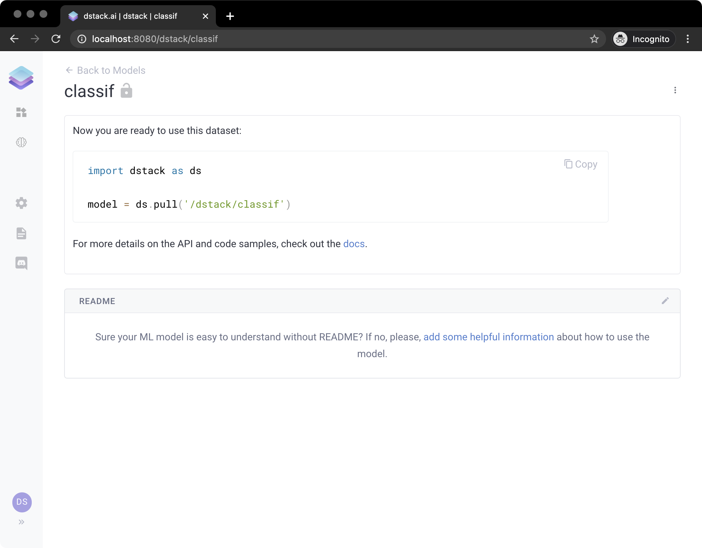

# ML Models

`dstack` decouples the development of applications from the development of ML models by offering a built-in ML registry. This way, one can develop ML models, push them to the registry, and then pull these models later from applications.

`dstack`'s  ML Registry supports `Tensorflow`, `PyTorch`, or `Scikit-Learn` models.

Here's a very simple example of how to push a model to `dstack`:

```python
from sklearn.svm import SVC
from sklearn.multiclass import OneVsRestClassifier
from sklearn.preprocessing import LabelBinarizer
import dstack as ds

X = [[1, 2], [2, 4], [4, 5], [3, 2], [3, 1]]
y = [0, 0, 1, 1, 2]

classif = OneVsRestClassifier(estimator=SVC(random_state=0))
classif.fit(X, y)

url = ds.push("classif", classif)
print(url)
```

Now, if you click the URL, it will open the following page:



Here, you can see a code snippet of how to pull the model from an application or from anywhere else:

```python
import dstack as ds

X = [[1, 2], [2, 4], [4, 5], [3, 2], [3, 1]]

classif = ds.pull('/dstack/classif')
classif.predict(X)
```

Also, here you can edit a `README.md` file to provide documentation on how to use the model. 

Check out the following tutorial that trains a more complex ML model and uses it in a `dstack` application:




