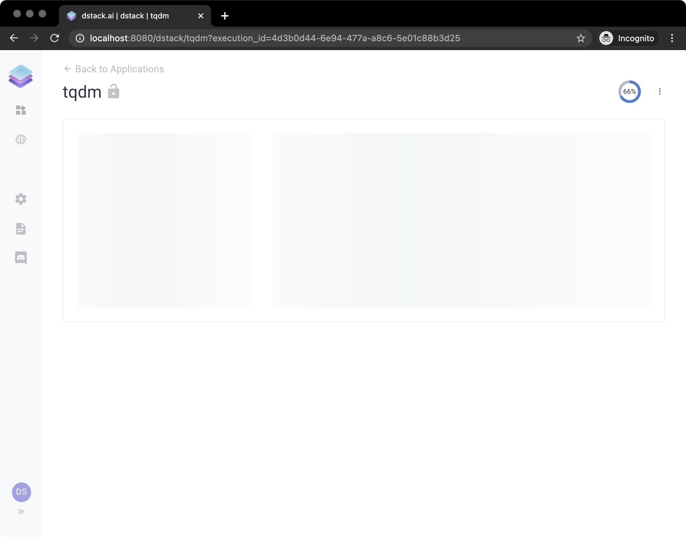

# Progress

`dstack` allows the application to report the progress via the `tqdm` package. In order to do that, you have to use `dstack.tqdm` or `dstack.trange` \(instead of `tqdm.tqdm` and `tqdm.trange`\).

Here's a quick example:

```python
from time import sleep
import dstack as ds

from dstack import trange

# Create an instance of the application
app = ds.app()


# A handler that sets the text to the markdown control
def markdown_handler(self):
    for _ in trange(100):
        sleep(0.5)
    self.text = "Finished"


# A markdown control
app.markdown(handler=markdown_handler)

# Deploy the application with the name "tqdm" and print its URL
result = app.deploy("tqdm")
print(result.url)
```

Now, if you run it and open the application, you'll see the following while the application is executing:




**`Live Demo:`** [**`https://dstack.cloud/gallery/tqdm`**](https://dstack.cloud/gallery/tqdm)**\`\`**



**Source Code:** [**https://github.com/dstackai/dstack-examples/blob/master/progress/app.py**](https://github.com/dstackai/dstack-examples/blob/master/progress/app.py)\*\*\*\*



