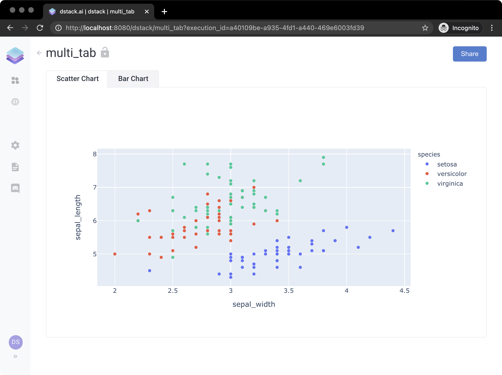

# Tabs

An application may have multiple tabs . Here's an example of the application with two tabs: `"Scatter Chart"` and `"Bar Chart"`:

```python
import dstack as ds
import plotly.express as px

app = ds.app()

scatter_tab = app.tab("Scatter Chart")


def scatter_handler(self):
    df = px.data.iris()
    self.data = px.scatter(df, x="sepal_width", y="sepal_length", color="species")


scatter_tab.output(handler=scatter_handler)


def bar_handler(self):
    df = px.data.tips()
    self.data = px.bar(df, x="sex", y="total_bill", color="smoker", barmode="group")


bar_tab = app.tab("Bar Chart")

bar_tab.output(handler=bar_handler)

url = app.deploy("tabs")
print(url)
```

If you open the application, you'll see the following:



When you invoke the `dstack.Application.tab()` function, you get an instance of `dstack.ApplicationBase` which has pretty much all functions that `dstack.Application` has so you can change its layout, and add controls.

**`TODO:`** `Add a link to the GitHub repo`

