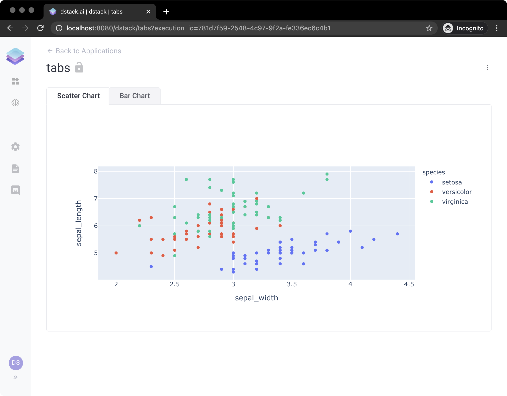

# Tabs

An application may have multiple tabs. Here's an example of a simple application with two tabs: `"Scatter Chart"` and `"Bar Chart"`:

```python
import dstack as ds
import plotly.express as px

# Create an instance of the application
app = ds.app()

# Create a tab
scatter_tab = app.tab("Scatter Chart")

# Create an output with a chart
scatter_tab.output(data=px.scatter(px.data.iris(), x="sepal_width", y="sepal_length", color="species"))

# Create a tab
bar_tab = app.tab("Bar Chart")

# Create an output with a chart
bar_tab.output(data=px.bar(px.data.tips(), x="sex", y="total_bill", color="smoker", barmode="group"))

# Deploy the application with the name "tabs" and print its URL
url = app.deploy("tabs")
print(url)
```

If you open the application, you'll see the following:




**`Live Demo:`** [**`https://dstack.cloud/gallery/tabs`**](https://dstack.cloud/gallery/tabs)**\`\`**



**Source Code:** [**https://github.com/dstackai/dstack-examples/blob/master/tabs/app.py**](https://github.com/dstackai/dstack-examples/blob/master/tabs/app.py)\*\*\*\*


When you invoke the `dstack.Application.tab()` function, you get an instance of `dstack.ApplicationBase` which has pretty much all functions that `dstack.Application` has so you can change its layout, and add controls.

Check out the following tutorial that uses a bit more complex layouts within multiple tabs:




