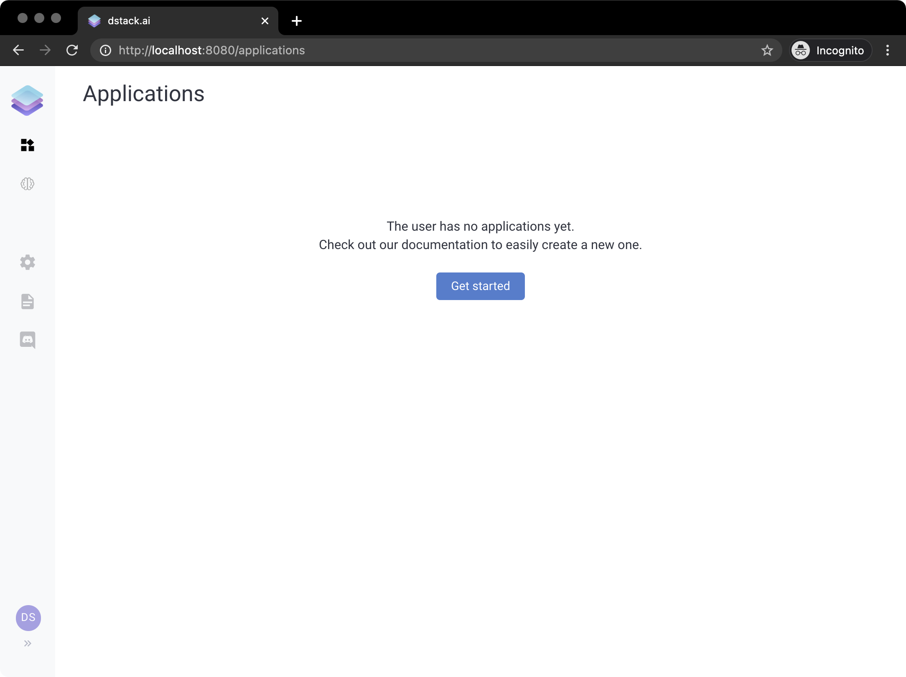
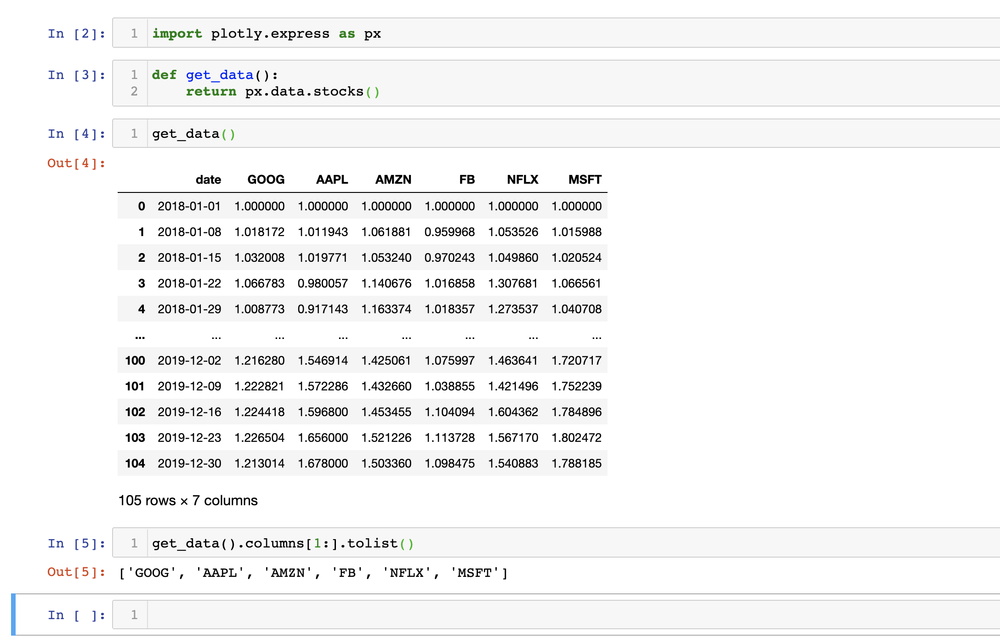
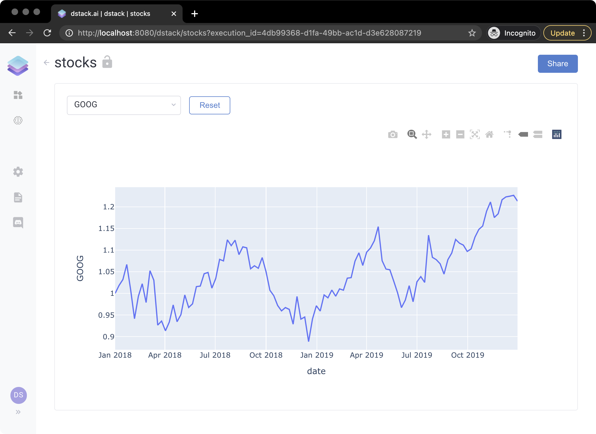

# 🚀 Quickstart

### Installation

Installing and running `dstack` is very easy:

```bash
pip install dstack==0.6.3
dstack server start
```

If you run it for the first time, it may take a while. Once it's done, you'll see the following output:

```bash
$ dstack server start
To access the application, open this URL in the browser: http://localhost:8080/auth/verify?user=dstack&code=xxxxxxxx-xxxx-xxxx-xxxx-xxxxxxxxxxxx&next=/

The default profile in "~/.dstack/config.yaml" is already configured. You are welcome to push your data using Python or R packages.

What's next?
------------
- Checkout our documentation: https://docs.dstack.ai
- Ask questions and share feedback: https://discord.gg/8xfhEYa
- Star us on GitHub: https://github.com/dstackai/dstack
```


To access `dstack`, click the URL provided in the output. Note, if you try to access dstack without using this URL, it will require you to sign up using a username and a password.


If you open the URL, you'll see the following interface:



You're logged as the `dstack` user. The current page is `Applications`. It shows you all published applications to which you have access. The sidebar on the left lets you open other pages: `ML Models`, `Settings`, `Documentation`, and `Chat`.

Now let's build a simple application to see how `dstack` works in action.

### Minimal Application

Here's an elementary example of using `dstack` for building an application that takes stock exchange data and renders it for the company selected by the user.

Imagine, we want to use `plotly` 's bundled dataset. Here's how it looks like:



The first column is the date, and the others are the prices for the stock associated with the column. Let's now see how you can use dstack to build an application that uses this data:

```python
import dstack as ds
import plotly.express as px

app = ds.app()  # create an instance of the application


# an utility function that loads the data
def get_data():
    return px.data.stocks()


# a drop-down control that shows stock symbols
stock = app.select(items=get_data().columns[1:].tolist())


# a handler that updates the plot based on the selected stock
def output_handler(self, stock):
    # a plotly line chart where the X axis is date and Y is the stock's price
    self.data = px.line(get_data(), x='date', y=stock.value())


# a plotly chart output
app.output(handler=output_handler, depends=[stock])

# deploy the application with the name "stocks" and print its URL 
url = app.deploy("stocks")
print(url)
```


**Source Code:** [**https://github.com/dstackai/dstack-examples/blob/master/stocks/app.py**](https://github.com/dstackai/dstack-examples/blob/master/stocks/app.py)\*\*\*\*


If you run this code and click the URL printed to the output, you'll see the application:



As you see, the user is prompted to choose a stock symbol to view how its price change from date to date.


**Live Gallery:** [**https://dstack.cloud/gallery/stocks**](https://dstack.cloud/gallery/minimal_app)\*\*\*\*


Now, to learn in more detail about what applications consist of and how to use all their features, proceed to the [Concepts](concepts/) page. See you there.



To see other examples, please check out the [Tutorials](tutorials/) page.

### Feedback

Do you have any feedback either minor or critical? Please, file [an issue](https://github.com/dstackai/dstack/issues) in our GitHub repo or write to us on our [Discord Channel](https://discord.com/invite/8xfhEYa).


**Have you tried `dstack`? Please share your feedback with us using** [**this**](https://forms.gle/4U6Z6hmZhbAtEDK29) **form!**


