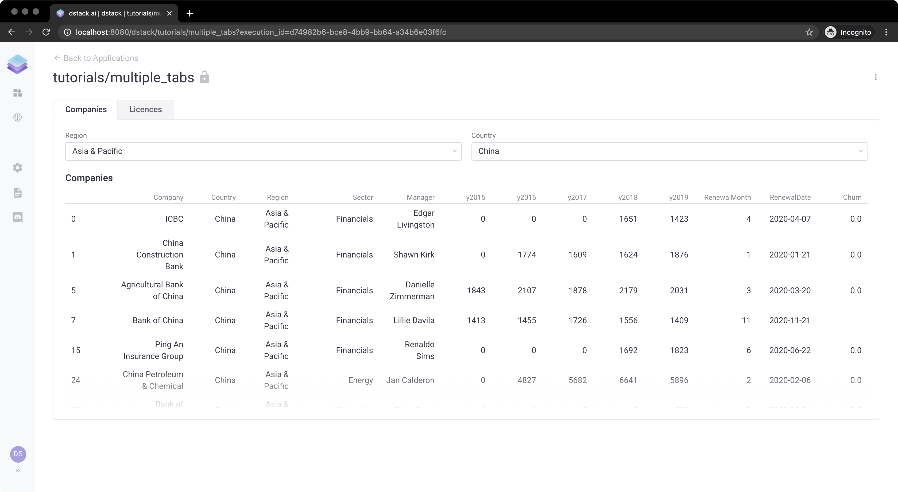

# Simple Application with Multiple Tabs

In this tutorial, we'll build an application that is very similar to the one that was covered in [Simple Application With Multiple Outputs](simple-application-with-multiple-outputs.md). However, instead of putting all controls together, we'll have multiple tabs. The application will still load CSV data from a URL and let the user of the application to browse through the data. 

In the first tab, titled `"Companies"`,  we'll show a drop-down control for selecting a region, another one for selecting a country, and a table to show companies for the selected country.

In the second tab, titled `"Licences"`,  we'll show a drop-down control to select a company, and a chart showing the licenses for the selected company. 

To make sure the data is cached and is not loaded on every interaction, we'll use the `dstack.cache()` annotation for the functions that load data.

Here's the full code for the application:

```python
import dstack as ds
import pandas as pd
import plotly.express as px

app = ds.app()  # create an instance of an application


# an utility function that loads the data
@ds.cache()  # caching the result
def get_data():
    return pd.read_csv("https://www.dropbox.com/s/cat8vm6lchlu5tp/data.csv?dl=1", index_col=0)


# create a tab; width - 12 columns
companies_tab = app.tab("Companies", columns=12)


# A handler that updates the regions drop down control
def regions_handler(self):
    df = get_data()
    self.items = df["Region"].unique().tolist()


# a drop-down control inside the sidebar showing regions
regions = companies_tab.select(handler=regions_handler, placeholder="Region", colspan=6, rowspan=1)


# a handler that updates the countries drop-down based on the selected region
def countries_handler(self, regions):
    df = get_data()
    self.items = df[df["Region"] == regions.value()]["Country"].unique().tolist()


# a drop-down control inside the sidebar showing countries based on the selected region
countries = companies_tab.select(handler=countries_handler, placeholder="Country", depends=[regions], colspan=6,
                                 rowspan=1)


# a handler that updates the table output showing companies based on the selected country
def country_output_handler(self, countries):
    df = get_data()
    self.data = df[df["Country"] == countries.value()]


# a table output showing companies based on the selected country
# width – 6 columns; height - 7 rows
companies_tab.output(handler=country_output_handler, label="Companies", depends=[countries], colspan=12, rowspan=6)

# create a tab; width - 12 columns
licences_tab = app.tab("Licences", columns=12)


# a handler that updates the companies drop-down control
def get_companies_by_country(self):
    df = get_data()
    self.items = df["Company"].unique().tolist()


# a drop-down control inside the main area showing companies based on the selected country
# width – 6 columns; height - 1 row
companies = licences_tab.select(handler=get_companies_by_country, label="Company", colspan=12, rowspan=1)


# an utility function that returns company licenses
@ds.cache()  # caching the result
def get_companies(company):
    df = get_data()
    df = df[df["Company"] == company].filter(["y2015", "y2016", "y2017", "y2018", "y2019"], axis=1)
    df.rename(columns={"y2015": "2015", "y2016": "2016", "y2017": "2017", "y2018": "2018", "y2019": "2019"},
              inplace=True)
    df = df.transpose()
    df.rename(columns={df.columns[0]: "Licenses"}, inplace=True)
    return df


# a handler that updates the chart output based on the selected company
def company_output_handler(self, companies):
    company = companies.value()
    df = get_companies(company)
    fig = px.bar(df.reset_index(), x="index", y="Licenses", labels={"index": "Year"})
    fig.update(layout_showlegend=False)
    self.data = fig
    self.label = company


# a chart output showing licences based on the selected company
# width – 12 columns; height - 6 rows
licences_tab.output(handler=company_output_handler, depends=[companies], colspan=12, rowspan=6)

# deploy the application with the name "stocks" and print its URL
url = app.deploy("tutorials/multiple_tabs")
print(url)

```

Now, if you run the code and open the application, you'll see the following:




**Live Demo:** [**https://dstack.cloud/gallery/tutorials/multiple\_tabs**](https://dstack.cloud/gallery/tutorials/multiple_tabs)\*\*\*\*



**Source Code:** [**https://github.com/dstackai/dstack-examples/blob/master/tutorials/multiple\_tabs.py**](https://github.com/dstackai/dstack-examples/blob/master/tutorials/multiple_tabs.py)\*\*\*\*


