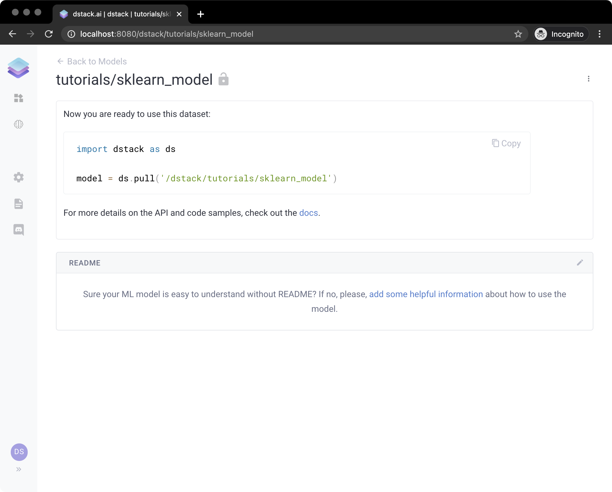
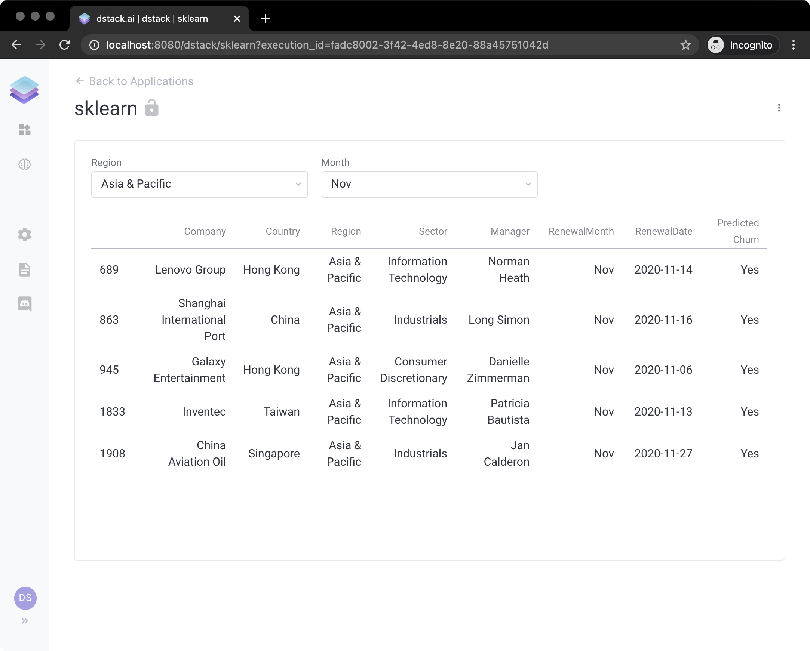

# Simple Application with a Scikit-learn ML Model

`dstack` decouples the development of applications from the development of ML models by offering an ML registry. This way, one can develop ML models, push them to the registry, and then later pull these models from applications. 

Here's an example. Let's start by training a very simple model:

```python
import pandas as pd
from sklearn.base import BaseEstimator, TransformerMixin
from sklearn.linear_model import LogisticRegression
from sklearn.model_selection import train_test_split
from sklearn.pipeline import Pipeline
import dstack as ds


class PrepareData(BaseEstimator, TransformerMixin):
    def __init__(self):
        pass

    def transform(self, X, **transform_params):
        X_copy = X.copy()

        def n_years(row):
            l = [row["y2019"], row["y2018"], row["y2017"], row["y2016"], row["y2015"]]
            return len([x for x in l if x != 0])

        X_copy["Years"] = X_copy.apply(n_years, axis=1)

        X_copy = X_copy.drop(["Company", "Region", "Manager", "RenewalMonth", "RenewalDate"], axis=1)

        for col in ["y2015", "y2016", "y2017", "y2018", "y2019"]:
            X_copy[col] = X_copy[col] / X_copy[col].max()

        for c in X["Country"].unique():
            X_copy[c] = X_copy["Country"].apply(lambda x: 1 if x == c else 0)

        for s in X["Sector"].unique():
            if s:
                X_copy[s] = X_copy["Sector"].apply(lambda x: 1 if x == s else 0)

        X_copy = X_copy.drop(["Country", "Sector"], axis=1)
        return X_copy

    def fit(self, X, y=None, **fit_params):
        return self


class ReindexColumns(BaseEstimator, TransformerMixin):
    def __init__(self, columns):
        self.columns = columns

    def transform(self, X, **transform_params):
        return X.reindex(columns=self.columns, fill_value=0)

    def fit(self, X, y=None, **fit_params):
        return self


df = pd.read_csv("https://www.dropbox.com/s/cat8vm6lchlu5tp/data.csv?dl=1", index_col=0).dropna()
X = df.drop(["Churn"], axis=1)
y = df["Churn"]

X_train, X_test, y_train, y_test = train_test_split(X, y, test_size=0.3, random_state=99)

X_train_columns = PrepareData().transform(X_train)

pipeline = Pipeline([
    ('prepare', PrepareData()),
    ('dummies', ReindexColumns(X_train_columns.columns)),
    ('lr', LogisticRegression())
])
pipeline.fit(X_train, y_train)

url = ds.push("tutorials/sklearn_model", pipeline)
print(url)
```

If we run this code, it will train the model and push it to `dstack`. In the output, you'll see its URL which you can use to view the model via the interface. If you click it, you'll see the following:




**Live Demo:** [**https://dstack.cloud/gallery/tutorials/sklearn\_model**](https://dstack.cloud/gallery/tutorials/sklearn_model)\*\*\*\*



**Source Code:** [**https://github.com/dstackai/dstack-examples/blob/master/sklearn/model.py**](https://github.com/dstackai/dstack-examples/blob/master/sklearn/model.py)\*\*\*\*


Now, this model is stored with `dstack`'s registry and can be pulled from any application. Let's look at an example of an application that uses this model:

```python
import dstack as ds
import numpy as np
import pandas as pd


def get_model():
    return ds.pull("tutorials/sklearn_model")


@ds.cache()
def get_data():
    df = pd.read_csv("https://www.dropbox.com/s/cat8vm6lchlu5tp/data.csv?dl=1", index_col=0)
    df = df[df["Churn"].isnull()].drop(["Churn"], axis=1)
    return df


months = ['Jan', 'Feb', 'Mar', 'Apr', 'May', 'Jun', 'Jul', 'Aug', 'Sep', 'Oct', 'Nov', 'Dec']


@ds.cache()
def get_predicted_data():
    df = get_data().copy()

    predicted_churn = get_model().predict(df)

    df["Predicted Churn"] = np.array(list(map(lambda x: "Yes" if x == 1.0 else "No", predicted_churn)))
    df["RenewalMonth"] = df["RenewalMonth"].apply(lambda x: months[x - 1])

    return df.drop(["y2015", "y2016", "y2017", "y2018", "y2019"], axis=1)


app = ds.app()

regions_ctrl = app.select(get_data()["Region"].unique().tolist(), label="Region")
months_ctrl = app.select(['Oct', 'Nov', 'Dec'], label="Month")
churn_ctrl = app.checkbox(label="Churn", selected=True)


def app_handler(self, regions_ctrl, months_ctrl, churn_ctrl):
    df = get_predicted_data().copy()

    df = df[(df["Predicted Churn"] == ("Yes" if churn_ctrl.selected else "No"))]
    df = df[(df["Region"] == regions_ctrl.value())]
    df = df[(df["RenewalMonth"] == months_ctrl.value())]
    self.data = df


app.output(handler=app_handler, depends=[regions_ctrl, months_ctrl, churn_ctrl])

url = app.deploy("sklearn")
print(url)
```

Now, if we run this code, and open the URL from the output, we'll see the following:




**Live Demo:** [**https://dstack.cloud/gallery/sklearn**](https://dstack.cloud/gallery/sklearn)\*\*\*\*



**Source Code:** [**https://github.com/dstackai/dstack-examples/blob/master/sklearn/app.py**](https://github.com/dstackai/dstack-examples/blob/master/sklearn/app.py)\*\*\*\*


Now, if you push another version of the model using the same name, the application will immediately switch to the new version of the model.

`dstack` supports `Tensorflow`, `PyTorch`, or `Scikit-Learn` models.

